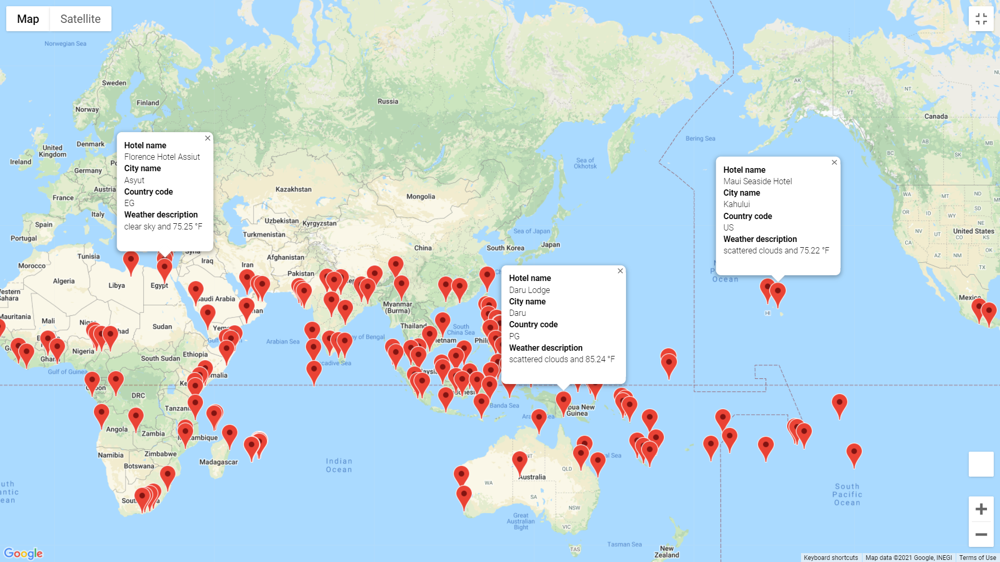
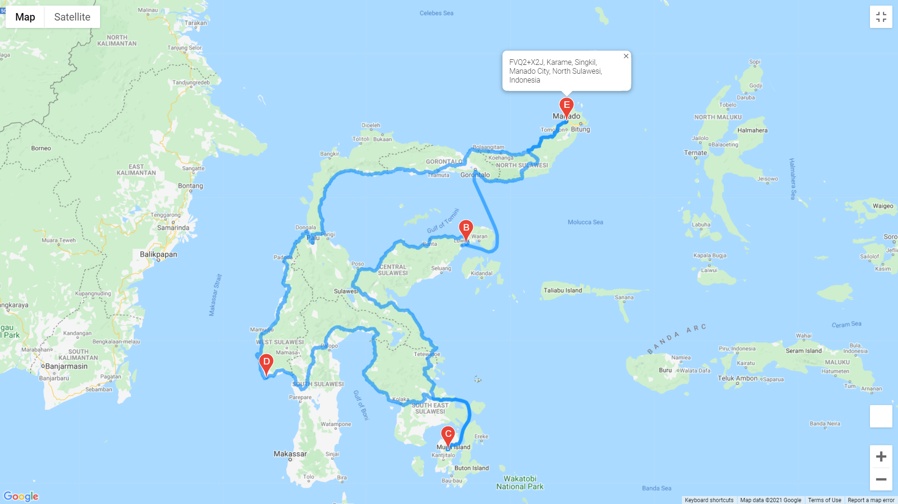

# World Weather Analysis

## Overview
The PlanMyTrip company is in the design stages of an app that will help customers find hotels based on location and weather preferences. They require assistance with processing the data, which uses both the [OpenWeather Map API](https://openweathermap.org/api) and [Google Maps API](https://developers.google.com/maps/)

## Results
World weather data was retrieved on November 27, 2021, and saved to a [csv file](weather_database/weather_database.csv). The data was retrieved by:
- Finding cities that are nearest to randomly generated longitude/latitude pairs using the citypy module.
- Retrieving weather data for the cities by parsing a JSON produced by the OpenWeather API call. The data includes max temperature, humidity, cloudiness, brief weather description, and wind speed.

Using the csv file above, and the Google Directions API, a new list of cities and nearby hotels was compiled, based on a user-selected maximum temperature range (in this case: 75 to 90 F); the data was cleaned up, and saved to a [csv file](vacation_search/vacation_search.csv). 

## Summary
This resulting information is displayed in Google Maps:

*Screenshot of the resulting Google Maps interface, displaying nearby hotels in locations with max temp between 75 and 90 F.*

Using the above map, 4 cities are selected, and an itinerary route is created:

*Screenshot of the resulting Google Maps interface, displaying an itinerary based on 4 selected cities.*

For these 4 cities, a new map is created, displaying the compiled information, which includes hotel and weather information:

*Screenshot of the resulting Google Maps interface, displaying nearby hotel, weather description and temperature for the 4 cities in the itinerary.*